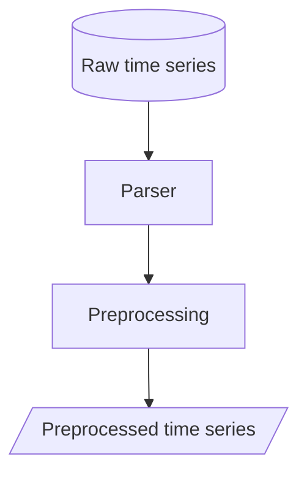
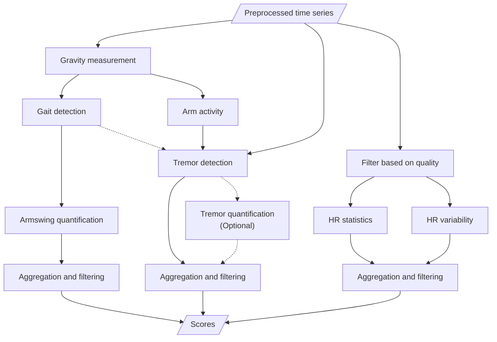

# Organization info

## Repositories

- Project documentation
    - [docs](https://github.com/biomarkersParkinson/docs): for general documentation.
- Data handling (input, output, conversion, decryption, ...):
    - [parkio](https://github.com/biomarkersParkinson/parkio): input/check/output of time series.
    - [ppp](https://github.com/biomarkersParkinson/ppp): loading utilities for the _ppp_ dataset.
    - [gait](https://github.com/biomarkersParkinson/gait): loading utilities for the _pdathome_ dataset.
    - [TimeStreamDB](https://github.com/biomarkersParkinson/TimeStreamDB): Max's code for data formatting.
    - [pep-download](https://github.com/biomarkersParkinson/pep-download): Peter's data acquisition scripts.

## Architecture

### Input

Although the inputs may differ in format, we expect them to contain time series information. On a per-patient basis, this can be read as an array where the first column contains the times, and the rest of the columns contain the corresponding measured states (such as accelerations, gyroscopic data, light intensity, ...):

| Times | Accel x   | Accel y   | ... |
|-------|-----------|-----------|-----|
| 0     | `<float>` | `<float>` | ... |
| 0.1   | `<float>` | `<float>` | ... |
| 0.2   | `<float>` | `<float>` | ... |
| 0.3   | `<float>` | `<float>` | ... |

In order to get those time series in a neat, usable way, a parsing and preprocessing workflow is needed for each data format:

### Desired output

Our desired output is a table containing different scores indicating the progression of Parkinson. Notice that we aggregate them at a much longer scale than the devices' resolutions. The intuitive reason for doing this is that in order to witness significant progresses in Parkinson's disease we need to wait weeks instead of miliseconds.

| Week | Gait score | Tremor score | ... |
|------|------------|--------------|-----|
| 1    | `<float>`  | `<float>`    | ... |
| 2    | `<float>`  | `<float>`    | ... |
| 3    | `<float>`  | `<float>`    | ... |
| 4    | `<float>`  | `<float>`    | ... |

Our proposed workflow to get there is the following:

## References

- [TSDF](https://arxiv.org/abs/2211.11294): a format standard for digital biosensor data
- [mcfly](https://github.com/NLeSC/mcfly): a deep-learning tool for time series classification created by the Netherlands eScience Center.
    - See [tutorial](https://blog.esciencecenter.nl/mcfly-an-easy-to-use-tool-for-deep-learning-for-time-series-classification-b2ee6b9419c2).
